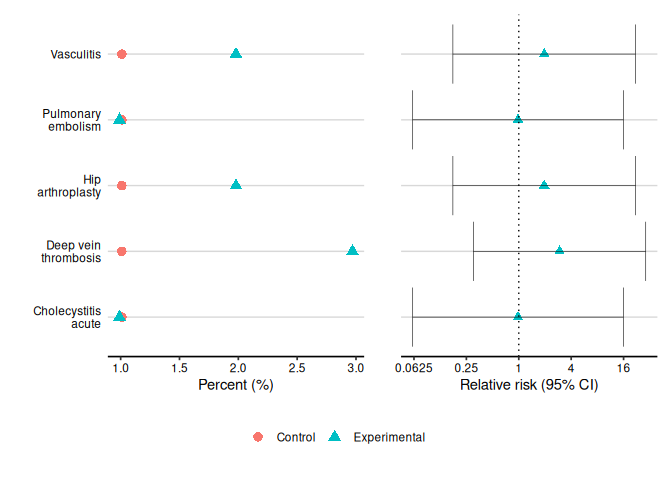

<!-- badges: start -->

[](https://github.com/shug0131/eudract_pkg/actions)
[](https://ci.appveyor.com/project/shug0131/eudract_pkg)
[](https://app.codecov.io/gh/shug0131/eudract_pkg?branch=master)
<!-- badges: end -->

<!-- README.md is generated from README.Rmd. Please edit that file -->

# eudract

The goal of eudract is to provide tools to easily produce summaries of
safety data from clinical trials that can easily be uploaded into
eudraCT or ClinTrials.gov .

An additional feature produces commonly used tables and figures that
feature in statistical reports and papers for clinical trials.

## Installation

You can install from CRAN directly with

``` r
install.packages("eudract")
```

You can install the very latest version on github with:

``` r
install.packages("devtools")
devtools::install_github("shug0131/eudract_pkg")
```

## Documentation

<https://eudract-tool.medschl.cam.ac.uk> provides full documentation

Go and read the help pages within R `?eudract::safety_summary`

``` r
safety_statistics <- safety_summary(safety,
                                    exposed=c("Experimental"=60,"Control"=67))
simple <- tempfile(fileext = ".xml")
eudract <- tempfile(fileext = ".xml")
ct <- tempfile(fileext = ".xml")
simple_safety_xml(safety_statistics, simple)
eudract_convert(input=simple,
                output=eudract)
clintrials_gov_convert(input=simple,
                       original=system.file("extdata", "1234.xml", package ="eudract"),
                output=ct)
\dontrun{
  # This needs a real user account to work
  clintrials_gov_upload(
    input=simple,
    orgname="CTU",
    username="Student",
    password="Guinness",
    studyid="1234"
    )

}
```

And for produce standard reporting outputs

``` r
library(eudract)
safety_statistics <- safety_summary(safety,
                                    exposed=c("Control"=99, "Experimental"=101))
safety_statistics$GROUP
#>          title subjectsAffectedBySeriousAdverseEvents
#> 1      Control                                     15
#> 2 Experimental                                     33
#>   subjectsAffectedByNonSeriousAdverseEvents deathsResultingFromAdverseEvents
#> 1                                        15                                9
#> 2                                        24                               22
#>   subjectsExposed deathsAllCauses
#> 1              99               9
#> 2             101              22
head( incidence_table(safety_statistics, type="serious")  )
#>                     System Organ Class               Preferred Term
#> 1 Blood and lymphatic system disorders              B-cell lymphoma
#> 2                    Cardiac disorders               Cardiac arrest
#> 3                                        Cardiac failure congestive
#> 4           Gastrointestinal disorders               Abdominal pain
#> 5                                             Gastroenteritis viral
#> 6                                      Gastrointestinal haemorrhage
#>   Control (N = 99) Experimental (N = 101)
#> 1        1% (1, 1)              0% (0, 0)
#> 2        1% (1, 1)              0% (0, 0)
#> 3        0% (0, 0)              1% (1, 1)
#> 4        1% (1, 1)              0% (0, 0)
#> 5        0% (0, 0)              1% (1, 1)
#> 6        0% (0, 0)              1% (1, 1)
relative_risk_table(safety_statistics, type="serious") 
#>                System Organ Class       Preferred Term Relative Risk (C.I.)
#> 1         Hepatobiliary disorders  Cholecystitis acute  0.98 (0.0605, 15.9)
#> 2         Immune system disorders           Vasculitis     1.96 (0.175, 22)
#> 3 Surgical and medical procedures     Hip arthroplasty     1.96 (0.175, 22)
#> 4              Vascular disorders Deep vein thrombosis   2.94 (0.301, 28.8)
#> 5                                   Pulmonary embolism  0.98 (0.0605, 15.9)
dot_plot(safety_statistics, type="serious", base=4) 
```


